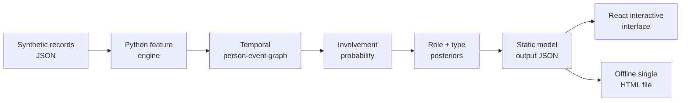

# The Machine: Manhattan

An interactive, explainable simulation of a fictional city-scale event inference system. The project is inspired by the *idea* of the Machine in *Person of Interest*: a system notices people who may soon become involved in a violent or financial event, while the original interface refuses to say whether they are a victim or a perpetrator.

## Easiest start: open the offline HTML

Download or clone the repository, then double-click:

```text
standalone/the-machine-manhattan.html
```

It is a single, self-contained file. It needs no server, account, VPN, Node.js,
Python, package installation, or internet connection. A Chinese walkthrough is
available in [docs/BEGINNER_GUIDE.zh-CN.md](docs/BEGINNER_GUIDE.zh-CN.md).

The hosted demo is optional; the offline file is the canonical beginner entry
point.

> [!IMPORTANT]
> Every identity, message, purchase, trip, location, incident, label, and score in this repository is invented. This is an educational interface and ML-systems project—not a tool for monitoring, profiling, policing, or making decisions about real people.

## What is in v0.3?

- A deterministic synthetic Manhattan scenario with 30 fictional people, 10 candidate events, and 3,400 heterogeneous observations. Only 31 records carry model-bearing tags; the rest are ordinary background activity.
- A Python inference engine using temporal decay, noisy-OR evidence fusion, one-hop graph propagation, logistic involvement scoring, role/type softmax models, and spatial kernel risk aggregation.
- A cinematic but legible React/TypeScript interface with:
  - **Machine View** — only red-frames people above the involvement threshold; role is deliberately hidden.
  - **Analyst View** — exposes involvement probability, victim/perpetrator/ambiguous posterior, crime-type mix, confidence, uncertainty, and score contributions.
  - **City Grid** — interactive fictional scenario risk across all 38 Manhattan [2020 Neighborhood Tabulation Areas](https://data.cityofnewyork.us/d/9nt8-h7nd), using simplified boundaries from NYC Department of City Planning release 26b.
  - **Evidence Graph** — shows how records, a person, and a candidate event connect.
  - **Model Core** — displays the exact equations used by the Python baseline.
- An adjustable threshold so the precision/coverage tradeoff is visible rather than concealed.
- Reproducible synthetic-ground-truth checks and CI.
- A dependency-free single-file HTML edition that works directly from `file://`.

## Architecture



Python owns data creation and inference. React does not fabricate scores; it reads the committed output in `app/data/machine-output.json` and renders it. This boundary keeps the mathematical pipeline reproducible while using HTML/CSS/TypeScript where they provide much better visual expression and interaction.

For the full derivation and the exact way the components are joined, read [docs/ALGORITHMS.md](docs/ALGORITHMS.md). The input schema is documented in [docs/DATA_MODEL.md](docs/DATA_MODEL.md).

## Quick start

Prerequisites:

- Python 3.11+
- Node.js 20.9+
- npm

Generate the deterministic model output from the committed JSON data:

```bash
python engine/run_pipeline.py
python tools/build_standalone.py
```

Install the interface and run it locally:

```bash
npm ci
npm run dev
```

Run the Python tests and production build:

```bash
python -m unittest discover -s tests -p "test_*.py"
npm run build
```

The Python baseline intentionally has no third-party dependencies. To rebuild
the standalone page after changing data, run:

```bash
python tools/build_standalone.py
```

## Deploying your fork

The repository is a standard Next.js application and does not depend on the
ChatGPT Sites runtime.

### Vercel

1. Push the extracted folder to a GitHub repository.
2. Import that repository in Vercel.
3. Keep the detected framework as **Next.js** and use the default build settings.
4. Deploy. No environment variables or database are required.

### Other Node hosts

Any host that supports a Next.js Node server can use:

```bash
npm ci
npm run build
npm start
```

GitHub Pages alone cannot run the default Next.js server build. If a fully
static Pages export is desired later, the application can be switched to
`output: "export"`; Vercel is the simplest deployment route for this version.

## Repository map

```text
app/                         React interface
  data/machine-output.json   Generated inference artifact imported by the UI
data/synthetic/              Fixed fictional source records and labels
docs/                        Algorithms, data contracts, ethics, and roadmap
engine/                      Python inference pipeline
public/data/                 Browser-readable copy of generated output
standalone/                   Offline single-file edition and readable template
tests/                       Pipeline and offline-HTML invariants
tools/                        Small build helper for the standalone HTML
```

## What the score means

The central output is

$$
p_{ie}=P(\text{person }i\text{ is involved in event }e\mid\text{synthetic evidence}).
$$

It is not a “criminality score.” A person can cross the relevance threshold because the evidence suggests they are being targeted. Only after involvement is estimated does the demo compute a separate conditional role posterior:

$$
P(r\mid I_{ie}=1),\qquad r\in\{\text{victim, perpetrator, ambiguous}\}.
$$

Machine View hides this second output to recreate the original dramatic constraint. Analyst View reveals it, along with uncertainty, so a probability is never presented as a verdict.

## Current limitations

- The scenario is fictional and deliberately controlled; the perfect synthetic precision/recall is a pipeline sanity check, not evidence of real predictive validity.
- Coefficients are transparent design parameters, not estimates learned from real crime data.
- Manhattan boundaries are simplified screen-space projections of official 2020 NTA geometry; they are suitable for this interface, not GIS analysis or navigation.
- The UI presents one fixed time slice; there is no live ingest or backend database yet.
- Correlated records can still be over-counted despite noisy-OR saturation.
- The role model is intentionally simple and should not be interpreted causally.

See [docs/ROADMAP.md](docs/ROADMAP.md) for the progression from this fixed scenario to a simulation clock, learned models, counterfactual evaluation, and richer graph reasoning.

## Responsible-use boundary

This repository excludes face recognition, real-person lookup, hidden data collection, scraping of private sources, and operational alert delivery. The design principles and failure modes are documented in [docs/ETHICS.md](docs/ETHICS.md).

## Attribution

This is an independent fan-inspired educational project. It is not affiliated with, endorsed by, or derived from source code belonging to CBS, Warner Bros., Bad Robot, or the creators of *Person of Interest*. No show footage, logos, character likenesses, scripts, or proprietary assets are included.

## License

MIT — see [LICENSE](LICENSE).
